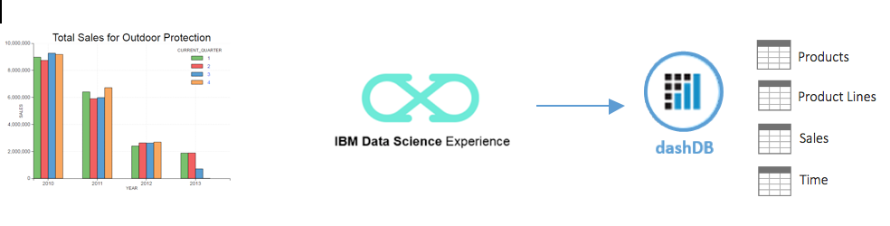

#Hands-On-Lab: Data Scientist
Analyze sales data in dashDB from IBM Data Science Experience using Spark based IPython Notebooks

#Introduction
IBM Data Science Experience is an interactive, collaborative, cloud-based environment where data scientists can use multiple tools to drive analytics and derive insights. Data Scientists can use Python, R, or Scala in Jupyter Notebooks already connected to Spark or RStudio for open source R computing environment.

This lab exercise uses an IPython Notebook in Data Science Experience to connect with dashDB, explores sales, product data and analyze sales performance for a specific product line. Pixiedust, a Python based visualization package is used to visualize the results.

##Steps for the Lab

###Provision dashDB  
1.	Login to IBM Bluemix  
a.	For existing accounts use  https://console.ng.bluemix.net/login  
b.	Sign-up for a free trial account at https://console.ng.bluemix.net/registration/  
2.	Provision dashDB   
a.	From the Bluemix catalog menu search for “dashdb”  
b.	Click on the dashDB Icon    
c.	Accept the default values and rename “Service name:” to ‘DS_Sales_DataStore’  
d.	Select “Entry Pricing Plan” (default) and click “Create” on the right hand panel.  
The lab exercise uses a sample database provisioned by dashDB service.  

###Data Science Experience
Provision Spark Service in Data Science Experience  

1.	Login to IBM Data Science Experience @ http://datascience.ibm.com/  
2.	Create a new Notebook  
a.	Click on ‘Start a Notebook”   
b.	If this is your first Notebook, you will see a message that you need Spark service. Click on ‘Create a Spark Service here’ link in the message to provision Spark Service.  
c.	Type ‘IA_Lab_Spark’ as the Spark service name and accept defaults (Personal plan for Spark service, New Object Storage with free plan).   
d.	Click ‘Create Instance’ to create Spark Service.  
###Create Notebook in Data Science Experience  
1.	On next screen, click on ‘New Notebook’ to create a notebook.  
2.	Type ‘IA_Lab_Notebook’ as Notebook name, click on ‘from URL’ link and specify   
https://github.com/ibmdataworks/sigmo-demos/tree/master/data-scientist/interactive-analytics/DSX_IA_Lab.ipynb  
 
e.	 Select ‘Trust this Notebook to run with your Privileges’ and click on ‘Create Notebook’   
 
3.	Once notebook is created, add connection details to access data sources.  
a.	On top left menu, click Menu -> Connections -> Create Connection  
b.	Key in ‘dashDB’ as connection name  
c.	From drop down list of ‘Target Service Instance’ select ‘DS_Sales_DataStore’, the dashDb service you provisioned in Bluemix.  
d.	Select ‘Database’ as ‘BLUDB’.   
e.	Click ‘Create’.  
4.	Open your Notebook and add the data source 
a.	Navigate to home with a click on ‘IBM Data Science Experience’ (top left) and open ‘DS Lab Notebook’  
b.	Click on ‘Data Sources’ and ‘Add Source’ 
 
c.	Click on Connections, select the connection named ‘dashDB’ 
d.	Click ‘Add Data Source’ 
 
5.	From the Notebook, connect to the sample sales database in dashDB 
a.	Place the cursor in the first cell. This should be empty, if not clear the contents.  
b.	Click on ‘Insert Code’  to insert credentials for the data source ‘dashDB’  
 
c.	Rename the inserted array variable ‘credentials_1’  to ‘credentials’ 
 
d.	To execute code in any notebook cell, place cursor in cell and click the arrow icon in toolbar 
 
e.	Place cursor in cell1, execute code to capture dashDB database credentials 
f.	Place cursor in cell2, execute code to connect, load tables from dashDB 
6.	Query, join and group data using SparkSQL Data frame API to build aggregated sales for the product line ‘Outdoor Protection’.  
a.	Place cursor in cell3 and execute code to build aggregated sales data frame 
b.	Place cursor in cell4 and execute code to install or update Pixiedust package 
c.	Place cursor in cell5 and execute code to  visualize SparkSQL Data frame 
 
7.	You can move the mouse over the visual to see data points on each bar. The chart shows a steady decline in sales for ‘Outdoor Protection’ product line. 
8.	Pixiedust is an open source visualization package developed by IBM labs. You can visualize SparkSQL data frames with a single API call and interactively access raw data, pick visual options and stow data away to files or IBM Cloudant or Object Storage.  

###End of Lab
Next Steps: Build your next Spark Analytics project using IBM Data Science Experience.

CLEANUP: Delete dashDB service ‘DS_Sales_DataStore’ from Bluemix, delete ‘IA_Lab_Notebook’ and ‘IA_Lab_Spark’ Spark service from Data Science Experience
